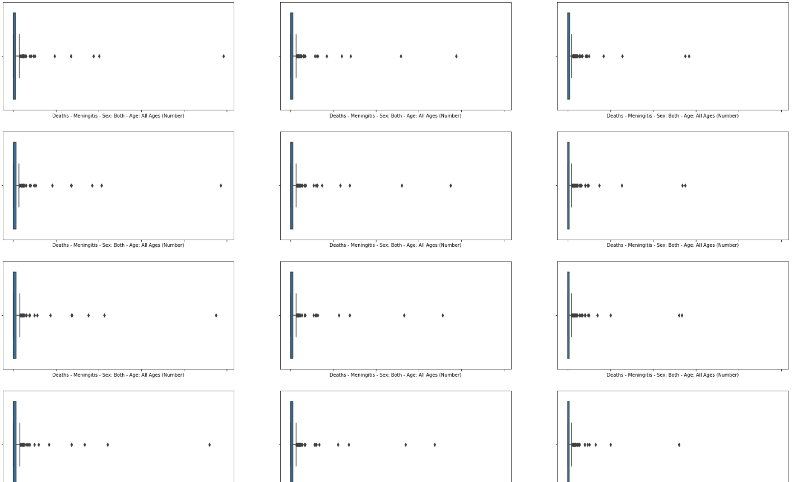
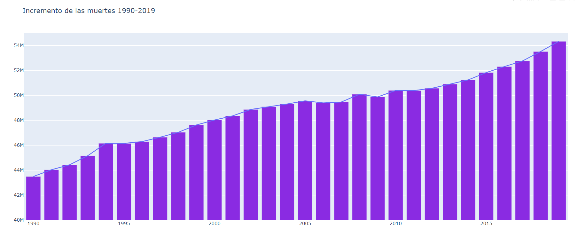
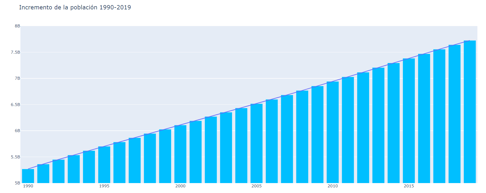
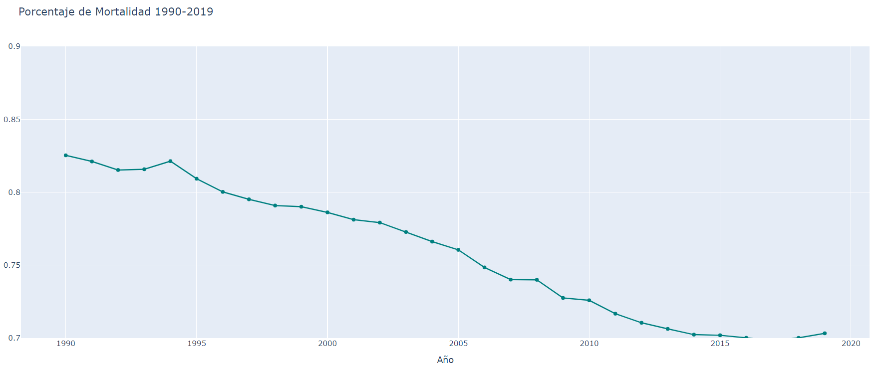
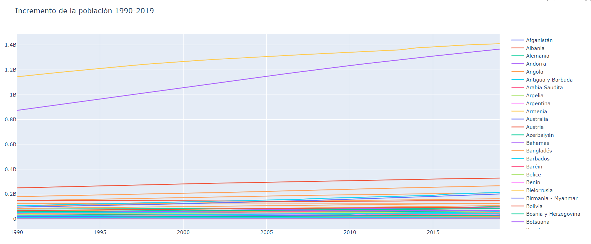
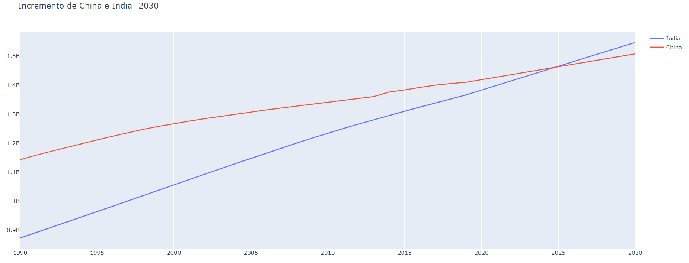
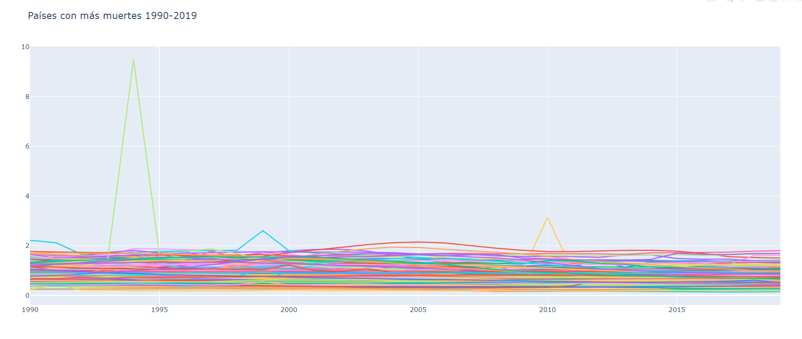
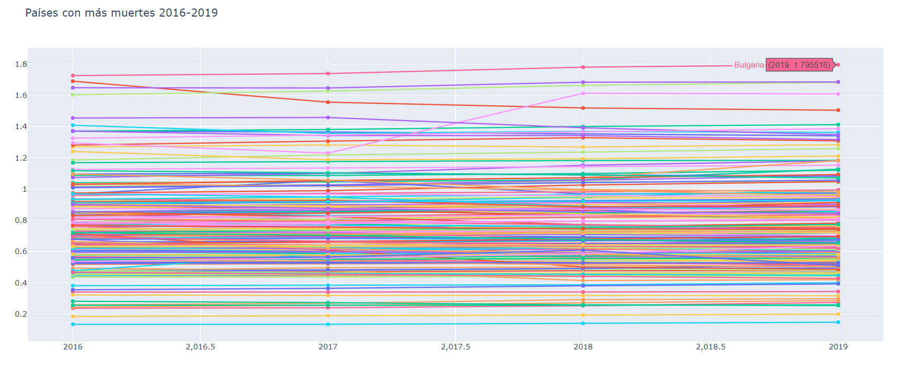

# Análisis Exploratorio sobre las muertes desde 1990 hasta 2019

### Este proyecto tiene como objetivo obtener respiestas a partir de varios datos sobre años de muertes en el mundo dependiendo de la causa, lugar, y fecha de las muertes. Se han concretado una serie de hipótesis sin argumentos y de las que se intentará saber si son verdaderas o falsas.

## Fuentes de Datos:
* > [OurWorldInData](https://ourworldindata.org/causes-of-death)
* > [epdata](https://www.epdata.es/evolucion-prevista-poblacion-mundial/62f77353-e957-4cb2-8cbb-bf49d4460cdf)
* > [CopyLists](https://copylists.com/geography/list-all-countries/#google_vignette)
* > [DatosMacro](https://datosmacro.expansion.com/demografia/poblacion)

## Hipótesis

1. El país con mayor tasa de mortálidad es Honduras proque tiene mayor tasa de criminalidad.
2. El año con mayor tasa de mortalidad fue 2019.
3. Aumenta proporcionalmente el número de muertes con el número de población mundial.
4. El mayor porcentaje de muertes por causas de la naturaleza/ poblacion del país es el Tsunami de 2004 de Indonesia.
5. El número de meurtes por SIDA ha bajado.
-----

### Este proyecto muestra conocimientos en:
* Python
* Modulos y funciones
* WebScraping
* Lectura de datos
* Interpretabilidad de datos
* Estadística
* Visualización de datos
* Limpieza de datos
* Transformación de Datos y Feature Enginering

------

### Organización de carpetas: 

* src/
    * data/: Contiene los archivos en formato csv usados en el proceso.
    
    * Graficas/: Contiene imágenes en formato html.

    * Images/: Contiene imágenes usadas en este archivo Markdown"

    * notebooks/: Un archivo Jupyter notebook para la obtencion de datos.

    *Utils/: Módulo con funciones que fueron útiles durante el proceso.

* memoria.ipynb/: Es el script que contiene solo los pasos para obtener el mejor modelo.

------

*En el archivo src/notebooks/WebScrapping.ipynb realizo un webscrapping a la página de datosmacro para obtener datos de la población de cada país entre 1990 y 2019*

## Limpieza de datos: 

### Antes de comenzar con el proyecto tuve que realizar una limpieza exhaustiva de datos eliminando columnas y registros que tenían bastantes valores nulos, añadir países, traducir el nombre de los países, filtrar por los países de los que tenía datos, eliminar los registros de los que me faltaban años, transformar valores de tipo texto a enteros, etc.

### El siguiente paso habría sido crear nuevos valores a partir de otros creando métricas o ratios como por ejemplo, la tasa de mortalidad por país.

### Luego comprobamos los valores atípicos que puedan haber visualizandolos mediante boxplots(En el notebook de Memoria.ipynb están justificados la mayoría de valores atípicos que aparecen)

## Análisis:

### **Ahora vamos a mostrar cierta información obtenida con este análisis**

### Incremento de muertes anuales:
*Incremento medio de 360.400 muertes anuales*

### Incremento de población mundial:
*Incremento medio 81.000.000 de personas al año*

### Decremento de la tasa de mortalidad:
*Decremento medio de un 0,004% al año*

### Incremento de la poblacion por países:

### Previsión apoximada población India/China -2030 :
*Incremento India: 16437991 personas más cada *año*
*Incremento China: 8891666 personas más cada año*

### Paises con más muertes(1990-2019):

### Paises con más muertes(2016-2019):

