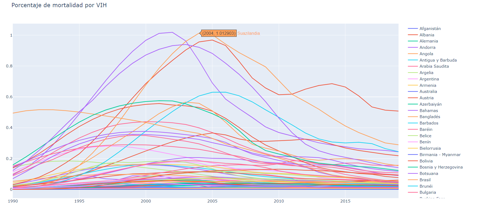
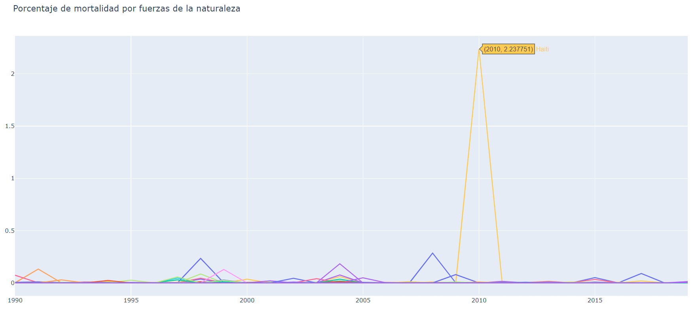

# Análisis Exploratorio sobre las muertes desde 1990 hasta 2019

### Este proyecto tiene como objetivo obtener respuestas a partir de varios datos sobre años de muertes en el mundo dependiendo de la causa, lugar, y fecha de las muertes. Se han concretado una serie de hipótesis sin argumentos y de las que se intentará saber si son verdaderas o falsas.

## Fuentes de Datos:
* > [OurWorldInData](https://ourworldindata.org/causes-of-death)
* > [epdata](https://www.epdata.es/evolucion-prevista-poblacion-mundial/62f77353-e957-4cb2-8cbb-bf49d4460cdf)
* > [CopyLists](https://copylists.com/geography/list-all-countries/#google_vignette)
* > [DatosMacro](https://datosmacro.expansion.com/demografia/poblacion)

## Hipótesis

1. El país con mayor mortálidad es Honduras proque tiene mayor tasa de criminalidad.
2. El año con mayor tasa de mortalidad fue 2019 debido al coronavirus.
3. Aumenta proporcionalmente el número de muertes con el número de población mundial.
4. El mayor porcentaje de muertes por causas de la naturaleza/ poblacion del país es el Tsunami de 2004 de Indonesia.
5. El número de muertes por SIDA ha bajado.
-----

### Este proyecto muestra conocimientos en:
* Python
* Modulos y funciones
* WebScraping
* Lectura de datos
* Interpretabilidad de datos
* Estadística
* Visualización de datos
* Limpieza de datos
* Transformación de Datos y Feature Enginering

------

### Organización de carpetas: 

* src/
    * data/: Contiene los archivos en formato csv usados en el proceso.
    
    * Graficas/: Contiene imágenes en formato html.

    * Images/: Contiene imágenes usadas en este archivo Markdown"

    * notebooks/: Un archivo Jupyter notebook para la obtencion de datos.

    *Utils/: Módulo con funciones que fueron útiles durante el proceso.

* memoria.ipynb/: Es el script que contiene solo los pasos para obtener el mejor modelo.

------

*En el archivo src/notebooks/WebScrapping.ipynb realizo un webscrapping a la página de datosmacro para obtener datos de la población de cada país entre 1990 y 2019*

## Limpieza de datos: 

### Antes de comenzar con el proyecto tuve que realizar una limpieza exhaustiva de datos eliminando columnas y registros que tenían bastantes valores nulos, añadir países, traducir el nombre de los países, filtrar por los países de los que tenía datos, eliminar los registros de los que me faltaban años, transformar valores de tipo texto a enteros, etc.

### El siguiente paso habría sido crear nuevos valores a partir de otros creando métricas o ratios como por ejemplo, la tasa de mortalidad por país.

### Luego comprobamos los valores atípicos que puedan haber visualizandolos mediante boxplots(En el notebook de Memoria.ipynb están justificados la mayoría de valores atípicos que aparecen)

## Análisis:

### **Ahora vamos a mostrar cierta información obtenida con este análisis**

### Incremento de muertes anuales:
*Incremento medio de 360.400 muertes anuales*

### Podemos ver como a medida que pasan los años cada vez vemos más y más muertes mundales, incrementa más o menos de una manera bastante lineal.

### Incremento de población mundial:
*Incremento medio 81.000.000 de personas al año*

### Vemos que la población mundial crece muy linealmente cada año cuando lo que uno se imaginaría sería un crecimiento exponencial.

### Decremento de la tasa de mortalidad:
*Decremento medio de un 0,004% al año*

### Esta gráfica nos indica que cada vez hay menor proporción de muertes con respecto a las personas totales en el planeta.

### Incremento de la poblacion por países:

### Los países que van claramente en la cabeza son China seguido de la India, en tercera posición estaría Estados unidos y luego Indonesia.

### Previsión apoximada población India/China -2030 :
*Incremento India: 16437991 personas más cada *año*
*Incremento China: 8891666 personas más cada año*

### Esto es una gráfica de como seguirá el crecimiento de los 2 países con mayor población y según esta estimacion la India llegará a tener aproximadamente la misma población que China en 2025 para después superarla en los próximos años.

### Paises con más muertes(1990-2019):

### Hay bastante variación desde 1990 hasta 2019 con respecto al país que iba en cabeza en el número de muertes pero vemos unos claros picos en Ruanda en 1994 a causa del llamado "Genocidio de Ruanda", con Eritrea en 1999 debido a la guerra con Etiopíay con Haití en 2010 debido a un terremoto.

### Paises con más muertes(2016-2019):

### Vemos que los paises con más muertes en estos últimos años son Bulgaria seguido de Ucrania y Serbia. Podemos destacar al bajada de muertes de Lesoto desde 2016.

### Incremendo del número de muertes globales por VIH:

### El año con mayores muertes por VIH fue 2005 y ya venían aumentando desde 1999, a partir de 2005 podemos ver una bajada significativa.

### Muertes por VIH:

### Entre el año 2000 y 2005 vemos que los países con mayores muertes por VIH son Botsuana, Suazilandia, Lesoto, Zimbabue, Sudáfrica seguidos de otros varios países del sur de África.

### Muertes por causas de la naturaleza:

### Podemos ver como hay varias pronuncuaciones en años concretos pero uno que llama mucho la atención es el de Haití en 2010 debido a un terremoto.

## Conclusiones:

1. El país con mayor mortálidad es Honduras proque tiene mayor tasa de criminalidad. **FALSO**
2. El año con mayor tasa de mortalidad fue 2019 deebido al coronavirus. **FALSO**
3. Aumenta proporcionalmente el número de muertes con el número de población mundial. **VERDADERO**
4. El mayor porcentaje de muertes por causas de la naturaleza/poblacion del país es el Tsunami de 2004 de Indonesia. **FALSO**
5. El número de muertes por SIDA ha bajado. **VERDADERO**
